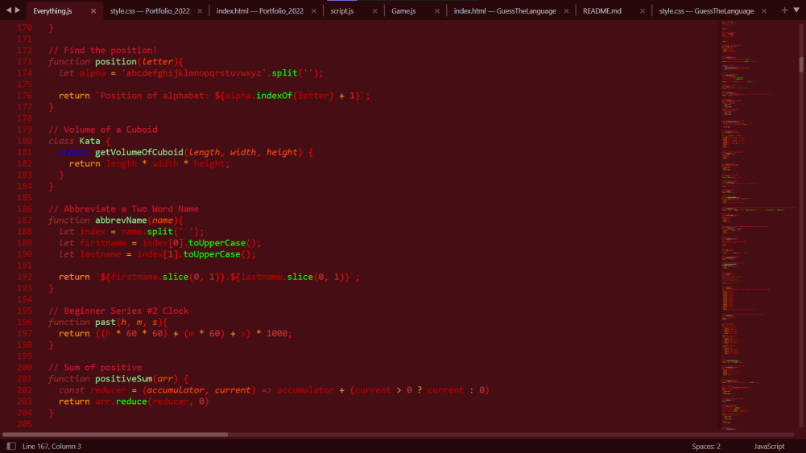

# Sublime-Text-color-theme-Django
My own created Sublime text color theme

**How to use it:**

Go into your sublime text and go on preferences -> Browse Packages -> User -> then put Django.sublime-color
after that, it's ready to use, just into preferences -> Select Color Scheme & then take Django
**And there you are!**

**Theme:**

